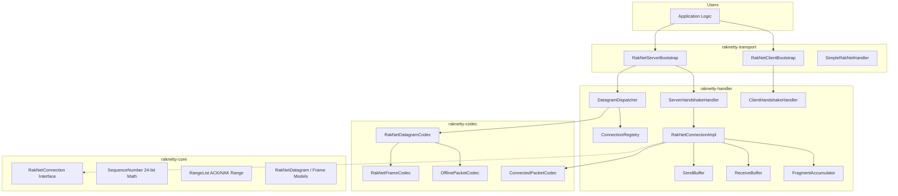

# RakNetty 종합 기술 문서 (Technical Documentation)

**RakNetty**는 [Netty 5](https://netty.io/) 비동기 이벤트 기반 네트워크 프레임워크 위에서 구현된 Kotlin 버전의 **RakNet(Reliable UDP) 프로토콜** 라이브러리입니다. 본 문서는 RakNetty의 목적, 아키텍처, 각 구성 요소의 상세한 기능, 실제 개발에 바로 활용 가능한 코드 예제 및 FAQ/핵심 설계 원칙을 개발자 관점에서 설명합니다.

---

## 1. 개요 (Overview)

### 1.1 RakNetty의 목적
UDP 프로토콜은 데이터 전송 속도가 빠르고 오버헤드가 적지만, 흐름 제어, 전송 순서 보장, 패킷 손실 복구 기능이 없습니다. 반면 TCP는 신뢰성을 보장하지만 성능 지연(Head-of-Line Blocking 등)이 발생할 수 있습니다. 
**RakNetty**는 UDP의 빠른 전송 속도와 TCP의 안정성을 결합한 **RakNet 프로토콜(Minecraft Bedrock Edition 등에서 널리 활용)**을 Kotlin과 Netty 5를 사용하여 완벽하게 현대화된 비동기 API로 제공합니다.

### 1.2 핵심 기능
* **신뢰성 전송 옵션**: 신뢰할 수 없는 전송(`UNRELIABLE`)부터 완벽히 순서가 보장되는 신뢰성 전송(`RELIABLE_ORDERED`)까지 총 8가지 전송 모드를 지원합니다.
* **단편화 및 재조립(Fragmentation & Reassembly)**: MTU 크기를 초과하는 대용량 페이로드를 조각내어 보내고 수신부에서 Zero-copy 합성 버퍼(`compose`) 형태로 조립하여 상위 레이어에 투명하게 전달합니다.
* **AIMD 혼잡 제어(Congestion Control)**: 네트워크 상태에 따라 전송 윈도우 크기를 조절(AIMD)하고 RTT(Round Trip Time) 기반으로 재전송 타임아웃(RTO)을 동적으로 갱신합니다.
* **Keepalive 및 비활성 타임아웃 감지**: 유휴 상태의 커넥션을 확인하기 위해 주기적으로 ping/pong을 수행하며 연결 유실 시 자동으로 타임아웃을 감지합니다.
* **멀티플렉싱(Multiplexing)**: 단일 물리적 UDP 포트에서 다수의 가상 연결(`RakNetConnection`)을 논리적으로 분리하고 라우팅합니다.

---

## 2. 구성 요소 세부 설명 (Detailed Component Specifications)

RakNetty는 Gradle 멀티 모듈 구조로 설계되어 있으며, 각 모듈은 다음과 같은 핵심 책임과 역할을 수행합니다.

---

### 2.1 raknetty-core (핵심 도메인 및 수학 모델)
Netty 라이브러리에 독립적인 순수 Kotlin 라이브러리로, 프로토콜 모델과 통신 패킷 구조, 롤링 알고리즘 등을 포함합니다.

* **[SequenceNumber](../raknetty-core/src/main/kotlin/io/github/agent0876/raknetty/core/util/SequenceNumber.kt)**
  * RakNet 프로토콜 규격에 따라 **24비트 정수 범위(`0` ~ `16,777,215`)**에서 순환(Wrap-around)하는 시퀀스 번호를 안전하게 다루기 위한 유틸리티입니다.
  * `isGreaterThan(a, b)`: 두 번호 간의 전방 거리가 $2^{23}$ 미만인지를 판단하여 순환 경계를 안전하게 비교합니다.
  * `distance(newer, older)`, `increment(n, delta)` 등을 통해 24비트 연산을 모듈러 연산으로 처리합니다.
* **[RangeList](../raknetty-core/src/main/kotlin/io/github/agent0876/raknetty/core/util/RangeList.kt)**
  * 패킷의 수신 확인(ACK) 및 유실 알림(NAK)에 사용하는 자료구조입니다.
  * 개별적인 일련번호를 하나씩 나열해 전송하는 대신, 연속된 번호 범위(예: `[10..15]`, `[18..18]`)로 자동 머징(Merging)하여 헤더 크기와 패킷 페이로드를 극대화하여 감소시킵니다.
* **[RakNetDatagram](../raknetty-core/src/main/kotlin/io/github/agent0876/raknetty/core/packet/RakNetDatagram.kt) & [RakNetFrame](../raknetty-core/src/main/kotlin/io/github/agent0876/raknetty/core/packet/RakNetFrame.kt)**
  * `RakNetDatagram`은 네트워크 망을 통해 송수신되는 물리적 UDP 패킷 단위입니다. 내부적으로 `Data`, `Ack`, `Nak` 타입으로 구별됩니다.
  * `RakNetFrame`은 `Data` 다이어그램 내부에 캡슐화되어 전송되는 가상 프레임 단위입니다. 신뢰성 인덱스(`reliableIndex`), 순서 지정 채널 번호 및 인덱스(`orderChannel`, `orderIndex`), 단편화 정보(`SplitInfo`) 등을 담고 있습니다.

---

### 2.2 raknetty-codec (바이너리 프로토콜 직렬화 레이어)
Netty 채널 핸들러 상태에 의존하지 않는 순수 인코더/디코더 객체들로 구성됩니다.

* **[RakNetDatagramCodec](../raknetty-codec/src/main/kotlin/io/github/agent0876/raknetty/codec/RakNetDatagramCodec.kt)**
  * UDP Datagram의 원시 바이너리 버퍼(`Buffer`)를 `RakNetDatagram` 객체로 역직렬화하거나 그 반대로 변환합니다.
  * `isOnlineDatagram(firstByte)`: 첫 바이트의 최상위 비트(MSB, `0x80`) 설정을 확인하여 이미 세션이 수립된 Online 상태 패킷(ACK, NAK, 데이터 다이어그램)인지, 오프라인 핸드셰이크 패킷인지를 식별합니다.
* **[RakNetFrameCodec](../raknetty-codec/src/main/kotlin/io/github/agent0876/raknetty/codec/RakNetFrameCodec.kt)**
  * 물리 다이어그램 내에 실려서 전송되는 하나 이상의 `RakNetFrame`을 안전하게 읽고 씁니다.
* **[OfflinePacketCodec](../raknetty-codec/src/main/kotlin/io/github/agent0876/raknetty/codec/offline/OfflinePacketCodec.kt) & [ConnectedPacketCodec](../raknetty-codec/src/main/kotlin/io/github/agent0876/raknetty/codec/connected/ConnectedPacketCodec.kt)**
  * 오프라인 상태 메시지(`UnconnectedPing`, `OpenConnectionRequest1`, `OpenConnectionReply2` 등)와 온라인 내부 제어 메시지(`ConnectionRequest`, `NewIncomingConnection`, `ConnectedPing/Pong` 등)를 처리합니다.

---

### 2.3 raknetty-handler (커넥션 상태 및 흐름 신뢰성 제어 레이어)
실질적인 연결 생성, 하트비트 스케줄링, 세션별 파이프라인 우회 라우팅을 담당합니다.

* **[DatagramDispatcher](../raknetty-handler/src/main/kotlin/io/github/agent0876/raknetty/handler/DatagramDispatcher.kt)**
  * 물리 UDP 소켓 채널 파이프라인의 최상단에 위치하며 `@Sharable` 성격을 가집니다.
  * 들어오는 모든 `DatagramPacket`을 캡처하여 온라인 데이터는 해당 원격 주소와 매핑된 `RakNetConnectionImpl`에 논리적으로 직접 수령시킵니다. 이로 인해 Netty 채널 파이프라인의 오버헤드를 건너뜁니다. 오프라인 패킷은 상위 파이프라인(예: `ServerHandshakeHandler`)에 그대로 흘려보냅니다.
* **[RakNetConnectionImpl](../raknetty-handler/src/main/kotlin/io/github/agent0876/raknetty/handler/connection/RakNetConnectionImpl.kt)**
  * 하나의 원격 주소와의 신뢰성 세션을 대표합니다.
  * 주기적으로 `EventLoop` 스레드를 통해 `tick()` 연산을 주기적(기본 10ms)으로 트리거합니다. 이 단계에서 미수신 데이터 재전송, 수신 완료 ACK/NAK 전송, 피어 연결 생존(ping) 유지, 그리고 비활성 커넥션 시간 초과 검사를 동시 수행합니다.
* **[SendBuffer](../raknetty-handler/src/main/kotlin/io/github/agent0876/raknetty/handler/reliability/SendBuffer.kt)**
  * 사용자가 보내고자 하는 데이터를 적절히 조각내고 큐에 쌓은 뒤 혼잡 창 크기(`cwnd`) 한도 내에서 최대한 패킷에 뭉쳐 전송합니다.
  * 미확인 패킷(Unacknowledged) 리스트를 유지하며 RTO 만료 시 해당 프레임들을 효율적으로 재전송 목록의 최우선 순위로 끌어올립니다.
* **[ReceiveBuffer](../raknetty-handler/src/main/kotlin/io/github/agent0876/raknetty/handler/reliability/ReceiveBuffer.kt)**
  * 중복 패킷 제거(`markReliableReceived`) 및 패킷 누락 감지(NAK 유발)를 담당합니다.
  * 순서 보장 채널(`orderChannel`)별로 아직 이전 순서의 패킷이 도착하지 않았다면 임시 수신 큐(`orderBuffers`)에 넣어 대기시켰다가 순서가 모두 채워지면 한꺼번에 상위 어플리케이션으로 전달(`drainOrdered`)합니다.
* **[FragmentAccumulator](../raknetty-handler/src/main/kotlin/io/github/agent0876/raknetty/handler/reliability/FragmentAccumulator.kt)**
  * MTU 초과로 쪼개진 단편 프레임들을 모아 composite 버퍼를 사용해 zero-copy 병합 처리를 진행합니다. 
  * 또한 데이터 전송 실패 혹은 상대측 비정상 종료 시 미완성 합성 버퍼들이 메모리를 계속 점유하고 누출(Leak)되는 것을 막기 위해 만료 타용아웃 스케줄링을 갖추고 있습니다.

---

### 2.4 raknetty-transport (최상위 부트스트랩)
사용자가 RakNetty를 간편하게 실행하고 제어할 수 있는 진입점을 구성합니다.

* **[RakNetServerBootstrap](../raknetty-transport/src/main/kotlin/io/github/agent0876/raknetty/transport/RakNetServerBootstrap.kt) & [RakNetClientBootstrap](../raknetty-transport/src/main/kotlin/io/github/agent0876/raknetty/transport/RakNetClientBootstrap.kt)**
  * 포트 바인딩 및 원격지 연결 수립 과정을 빌더 패턴으로 매핑합니다. 내부적으로 `ConnectionRegistry`, `DatagramDispatcher`, `HandshakeHandler` 등을 세팅하여 Netty 5 구동 흐름을 감싸안습니다.
* **[SimpleRakNetHandler](../raknetty-transport/src/main/kotlin/io/github/agent0876/raknetty/transport/SimpleRakNetHandler.kt)**
  * Netty의 `SimpleChannelInboundHandler`를 상속하며, RakNet 라이프사이클 이벤트(`onConnect`, `onMessage`, `onDisconnect`)를 추상 함수 형태로 구현할 수 있게 도와줍니다.

---

## 3. FAQ 및 중요한 설계 원칙 (FAQ & Key Invariants)

### Q1. Netty 5 `Buffer` 라이프사이클 및 메모리 누수 방지 규칙은 무엇인가요?
**버퍼 소유권 이관 규칙**: `RakNetConnection.send()` 함수를 호출하는 즉시, 전달한 `Buffer` 객체의 생명주기 관리 권한은 전적으로 RakNetty 라이브러리가 가져갑니다. 호출한 비즈니스 애플리케이션 코드는 `send()` 이후 해당 버퍼를 절대 close하거나 수정하거나 읽어서는 안 됩니다.

또한, `SimpleRakNetHandler.onMessage()` 콜백에 전달되는 `payload` 버퍼는 프레임워크 내 `finally` 블록에 의해 **콜백이 반환되는 시점에 자동으로 `close()` 처리**됩니다. 
따라서 만약 수신 데이터를 비동기 다른 스레드 풀에서 사용하거나 다른 세션으로 전달해야 한다면, 콜백을 벗어나기 전에 **반드시 `payload.copy()`를 수행**하여 복사본을 생성해 사용해야 합니다.

---

### Q2. 24비트 시퀀스 번호 순환(Wrap-around) 경계에서 버그가 발생하지 않나요?
RakNet 프로토콜은 시퀀스 번호를 24비트 단위로 축약해 사용합니다. 이는 전송 속도를 높이기 위함이지만 일반적인 $A > B$ 형태의 부등호 연산을 할 경우 $16,777,215$를 초과해 $0$으로 돌아갔을 때 논리적 역전 현상이 생깁니다.
이를 해결하고자 RakNetty 내부 소스 코드 전체에서는 정수형 산술 비교연산을 금지하고, `SequenceNumber` 객체 내부의 비트 마스킹 헬퍼만을 사용하여 시퀀스의 대소관계를 확인합니다.
* **비교 로직**: `(a - b) and 0xFFFFFF` 값이 `0`보다 크고 $2^{23}$보다 작으면 `a`가 더 최신 패킷인 것으로 상호 약속합니다.

---

### Q3. NAK 알림 시 번호 순환 충돌로 프로그램이 강제 종료되거나 멈춘 적이 있었습니다. 어떻게 되었나요?
* **발생 원인**: 이전에 순환 임계점 근처(예: 기대 순서 `16,777,213`)에서 아주 작은 순서 번호(예: `2`)를 수신했을 때 빈 틈새가 감지되어 NAK 범위 `[16,777,213..1]`이 산출되었습니다. 하지만 기존 `RangeList.addRange` 함수 내부에 있는 `require(start <= end)` 검증 규칙에 의해 부등식 불만족 예외(`IllegalArgumentException`)가 터지면서 통신 디스패처 자체가 정지하는 고질적 버그가 존재했습니다.
* **해결책**: 최신 코드는 수신 버퍼(`ReceiveBuffer`) 단에서 갭 탐지 수행 시 시퀀스가 wrap-around 된 경우 이를 단일 경계가 아닌 순차 경계 리스트 `[nakStart..MAX]`와 `[0..nakEnd]` **두 개의 개별 범위로 쪼개어 전달**하도록 패치되었습니다.

---

### Q4. 패킷의 우선순위 설정 중 `IMMEDIATE`와 `NORMAL`은 어떤 전송 차이를 보인가요?
* **RakNetPriority.IMMEDIATE**:
  * 혼잡 제어 및 전송 대기 큐를 생략하고 다음 `tick()` 주기 때 즉시 UDP 패킷 형태로 상대방에게 송신합니다. 주로 실시간 생존을 증명하는 ping/pong 하트비트나 연결 제어 프로토콜 조작을 처리할 때만 매우 보수적으로 적용해야 합니다.
* **RakNetPriority.NORMAL**:
  * 일반적인 게임 월드 상태나 데이터 통신에 사용합니다. 전송 큐에 정상 정렬되어 혼잡 제어 윈도우 크기에 부합할 때 순차 송신되므로 안정적이고 망을 가로막지 않습니다.
